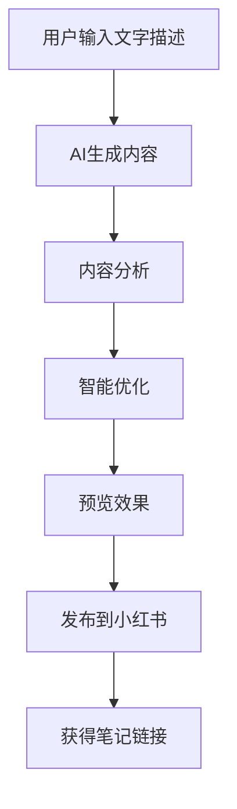
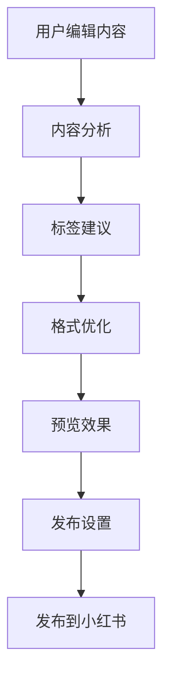

# 小红书发布功能集成文档

## 功能概述

YouCreator.AI 小红书发布功能允许用户将AI生成的内容（图片、音乐、文字）智能优化并一键发布到小红书平台。

## 核心功能

### 1. AI内容生成 → 小红书发布流程

```
文字描述 → AI生成内容 → 智能优化 → 发布到小红书
```

#### 支持的内容类型
- **文字配图**: 根据文字描述生成图片
- **文字配乐**: 根据文字描述生成音乐
- **图片配乐**: 为图片生成匹配的背景音乐

### 2. 智能内容优化

#### 内容分析
- 主题识别（美食、旅行、时尚、美妆等）
- 情感分析（开心、平静、感动等）
- 风格分析（简约、详细、图文并茂等）
- 关键词提取

#### 自动优化
- 标题优化（添加emoji、吸引人的表达）
- 内容格式化（段落分隔、互动引导）
- 标签生成（基于主题、情感、关键词）
- 发布时间建议

### 3. 小红书风格适配

#### 标题优化
```javascript
// 原标题: "美丽的风景"
// 优化后: "🌸 美丽的风景分享"
```

#### 内容格式化
```javascript
// 添加emoji和互动引导
// 原内容 + "\n\n🌸 生活中的小美好，你们也有吗？"
```

#### 标签建议
- 主题标签：基于内容主题生成
- 情感标签：基于情感分析生成
- 热门标签：结合平台趋势
- 关键词标签：基于内容关键词

## 技术架构

### 后端服务 (Go)

```
backend/
├── internal/
│   ├── service/
│   │   └── xiaohongshu_service.go    # 小红书发布服务
│   ├── handler/
│   │   └── xiaohongshu_handler.go    # HTTP处理器
│   └── router/
│       └── xiaohongshu_routes.go     # 路由配置
```

#### 主要服务方法
- `AnalyzeContent()` - 内容分析
- `FormatContent()` - 内容格式化
- `PublishNote()` - 发布笔记
- `BatchPublish()` - 批量发布

### 前端组件 (React/Next.js)

```
frontend/src/
├── services/
│   └── xiaohongshuService.ts         # 小红书API服务
├── components/
│   ├── xiaohongshu/
│   │   └── XiaohongshuPublisher.tsx  # 发布组件
│   └── media/
│       └── MediaToXiaohongshu.tsx    # 媒体到小红书集成
└── app/
    └── xiaohongshu/
        └── page.tsx                  # 小红书页面
```

#### 主要组件功能
- **XiaohongshuPublisher**: 完整的发布界面
- **MediaToXiaohongshu**: AI创作到小红书的完整流程
- **内容预览**: 实时预览发布效果
- **智能优化**: 一键优化内容格式

## API 接口

### 1. 内容分析
```http
POST /api/v1/xiaohongshu/analyze
Content-Type: application/json

{
  "title": "标题",
  "content": "内容",
  "images": ["图片URL"],
  "tags": ["标签"]
}
```

### 2. 内容格式化
```http
POST /api/v1/xiaohongshu/format
Content-Type: application/json

{
  "title": "原标题",
  "content": "原内容"
}
```

### 3. 发布笔记
```http
POST /api/v1/xiaohongshu/publish
Content-Type: application/json

{
  "user_id": 1,
  "note_content": {
    "title": "标题",
    "content": "内容",
    "images": ["图片URL"],
    "tags": ["标签"],
    "location": "位置"
  },
  "auto_format": true,
  "auto_tags": true
}
```

### 4. 预览效果
```http
POST /api/v1/xiaohongshu/preview
Content-Type: application/json

{
  "title": "标题",
  "content": "内容"
}
```

## 部署配置

### 环境变量

```bash
# 小红书API配置
XIAOHONGSHU_API_KEY=your_api_key
XIAOHONGSHU_API_SECRET=your_api_secret
XIAOHONGSHU_BASE_URL=https://api.xiaohongshu.com

# 内容限制
MAX_TITLE_LENGTH=30
MAX_CONTENT_LENGTH=1000
MAX_TAGS_COUNT=8
MAX_IMAGES_COUNT=9

# 发布限制
PUBLISH_RATE_LIMIT=10  # 每分钟最多发布次数
BATCH_MAX_SIZE=10      # 批量发布最大数量
```

### Docker 配置

```dockerfile
# 在现有的 docker-compose.yml 中添加环境变量
services:
  backend:
    environment:
      - XIAOHONGSHU_API_KEY=${XIAOHONGSHU_API_KEY}
      - XIAOHONGSHU_API_SECRET=${XIAOHONGSHU_API_SECRET}
```

## 使用流程

### 1. AI创作 → 小红书发布



### 2. 直接发布内容



## 智能优化算法

### 1. 主题识别

```go
func (s *XiaohongshuService) analyzeTheme(content NoteContent) string {
    text := strings.ToLower(content.Title + " " + content.Content)
    
    themes := map[string][]string{
        "美食": {"美食", "食物", "餐厅", "菜谱"},
        "旅行": {"旅行", "旅游", "景点", "攻略"},
        "时尚": {"时尚", "穿搭", "服装", "搭配"},
        // ... 更多主题
    }
    
    // 计算匹配分数，返回最佳主题
}
```

### 2. 标签生成

```go
func (s *XiaohongshuService) generateTagSuggestions(analysis *ContentAnalysis) []TagSuggestion {
    var suggestions []TagSuggestion
    
    // 基于主题的标签
    themeTagsMap := map[string][]string{
        "美食": {"美食分享", "好吃推荐", "美食探店"},
        "旅行": {"旅行分享", "旅游攻略", "风景打卡"},
        // ... 更多标签映射
    }
    
    // 生成标签建议
    return suggestions
}
```

### 3. 内容格式化

```go
func (s *XiaohongshuService) formatContentBody(content string, analysis *ContentAnalysis) string {
    // 添加段落分隔
    formatted := strings.Replace(content, "。", "。\n\n", -1)
    
    // 添加emoji
    emojiMap := map[string]string{
        "美食": "🍽️",
        "旅行": "✈️",
        "时尚": "👗",
        // ... 更多emoji映射
    }
    
    // 添加互动引导
    interactionPrompts := []string{
        "\n\n你们觉得怎么样？",
        "\n\n有同感的小伙伴吗？",
        // ... 更多互动提示
    }
    
    return formatted
}
```

## 前端集成示例

### 1. 使用 XiaohongshuPublisher 组件

```tsx
import XiaohongshuPublisher from '@/components/xiaohongshu/XiaohongshuPublisher';

function MyPage() {
  const handlePublished = (noteId: string, url: string) => {
    console.log('发布成功:', { noteId, url });
  };

  return (
    <XiaohongshuPublisher
      initialContent={{
        title: "AI生成的标题",
        description: "AI生成的内容",
        imageUrl: "生成的图片URL",
        audioUrl: "生成的音频URL"
      }}
      onPublished={handlePublished}
    />
  );
}
```

### 2. 使用 MediaToXiaohongshu 完整流程

```tsx
import MediaToXiaohongshu from '@/components/media/MediaToXiaohongshu';

function CreationPage() {
  return (
    <MediaToXiaohongshu />
  );
}
```

## 数据流转

### 1. 内容生成阶段

```
用户输入 → AI服务 → 生成结果 → 前端展示
```

### 2. 内容优化阶段

```
原始内容 → 内容分析 → 智能优化 → 格式化结果
```

### 3. 发布阶段

```
优化内容 → 发布请求 → 小红书API → 发布结果
```

## 错误处理

### 1. 内容验证错误

```javascript
// 前端验证
const validation = xiaohongshuService.validateNoteContent(content);
if (!validation.valid) {
  toast.error(validation.errors[0]);
  return;
}
```

### 2. API调用错误

```go
// 后端错误处理
if resp.StatusCode != http.StatusOK {
    return nil, fmt.Errorf("小红书API返回错误: %s", string(body))
}
```

### 3. 网络错误处理

```typescript
// 前端网络错误处理
try {
  const response = await xiaohongshuService.publishNote(request);
} catch (error) {
  if (error.code === 'NETWORK_ERROR') {
    toast.error('网络连接失败，请检查网络设置');
  } else {
    toast.error('发布失败，请稍后重试');
  }
}
```

## 性能优化

### 1. 内容分析缓存

```go
// 缓存分析结果
type AnalysisCache struct {
    cache map[string]*ContentAnalysis
    mutex sync.RWMutex
}

func (c *AnalysisCache) Get(key string) (*ContentAnalysis, bool) {
    c.mutex.RLock()
    defer c.mutex.RUnlock()
    analysis, exists := c.cache[key]
    return analysis, exists
}
```

### 2. 批量处理优化

```go
// 批量发布时添加延迟避免频率限制
for i, req := range requests {
    response, err := s.PublishNote(ctx, req)
    responses[i] = response
    
    // 添加延迟
    if i < len(requests)-1 {
        time.Sleep(2 * time.Second)
    }
}
```

### 3. 前端性能优化

```typescript
// 使用防抖优化内容分析
const debouncedAnalyze = useMemo(
  () => debounce(handleAnalyzeContent, 1000),
  []
);

useEffect(() => {
  if (noteContent.title && noteContent.content) {
    debouncedAnalyze();
  }
}, [noteContent.title, noteContent.content]);
```

## 监控和日志

### 1. 发布成功率监控

```go
// 记录发布统计
type PublishStats struct {
    TotalRequests int64
    SuccessCount  int64
    FailureCount  int64
    SuccessRate   float64
}

func (s *XiaohongshuService) recordPublishResult(success bool) {
    // 更新统计数据
}
```

### 2. 错误日志记录

```go
// 详细的错误日志
s.logger.Error("小红书发布失败", 
    zap.String("user_id", req.UserID),
    zap.String("title", req.NoteContent.Title),
    zap.Error(err),
    zap.String("request_id", requestID))
```

## 安全考虑

### 1. 内容审核

```go
// 内容安全检查
func (s *XiaohongshuService) validateContent(content *NoteContent) error {
    // 检查敏感词
    if containsSensitiveWords(content.Content) {
        return errors.New("内容包含敏感词汇")
    }
    
    // 检查内容长度
    if len(content.Content) > MAX_CONTENT_LENGTH {
        return errors.New("内容长度超过限制")
    }
    
    return nil
}
```

### 2. 频率限制

```go
// 用户发布频率限制
type RateLimiter struct {
    requests map[string][]time.Time
    mutex    sync.RWMutex
}

func (r *RateLimiter) Allow(userID string) bool {
    // 检查用户发布频率
}
```

### 3. API密钥安全

```bash
# 环境变量方式存储敏感信息
export XIAOHONGSHU_API_KEY="your_secure_api_key"
export XIAOHONGSHU_API_SECRET="your_secure_api_secret"
```

## 测试策略

### 1. 单元测试

```go
func TestAnalyzeContent(t *testing.T) {
    service := NewXiaohongshuService(logger, config)
    
    content := NoteContent{
        Title:   "美食分享",
        Content: "今天吃了很好吃的火锅",
    }
    
    analysis, err := service.AnalyzeContent(context.Background(), content)
    assert.NoError(t, err)
    assert.Equal(t, "美食", analysis.Theme)
}
```

### 2. 集成测试

```go
func TestPublishNote(t *testing.T) {
    // 测试完整的发布流程
}
```

### 3. 前端测试

```typescript
// 组件测试
describe('XiaohongshuPublisher', () => {
  it('should validate content before publishing', () => {
    // 测试内容验证逻辑
  });
});
```

## 部署检查清单

- [ ] 配置小红书API密钥
- [ ] 设置内容限制参数
- [ ] 配置发布频率限制
- [ ] 启用错误日志记录
- [ ] 配置监控指标
- [ ] 测试发布流程
- [ ] 验证内容优化效果
- [ ] 检查安全设置

## 故障排除

### 常见问题

1. **发布失败**: 检查API密钥配置和网络连接
2. **内容格式错误**: 验证内容长度和格式要求
3. **频率限制**: 检查发布频率设置
4. **标签生成失败**: 检查内容分析服务状态

### 日志查看

```bash
# 查看小红书服务日志
docker-compose logs -f backend | grep xiaohongshu

# 查看发布统计
curl http://localhost:8080/api/v1/xiaohongshu/stats?user_id=1
```

这个完整的小红书发布功能为YouCreator.AI平台提供了从AI内容生成到社交媒体发布的完整闭环，大大提升了用户的创作和分享体验。
